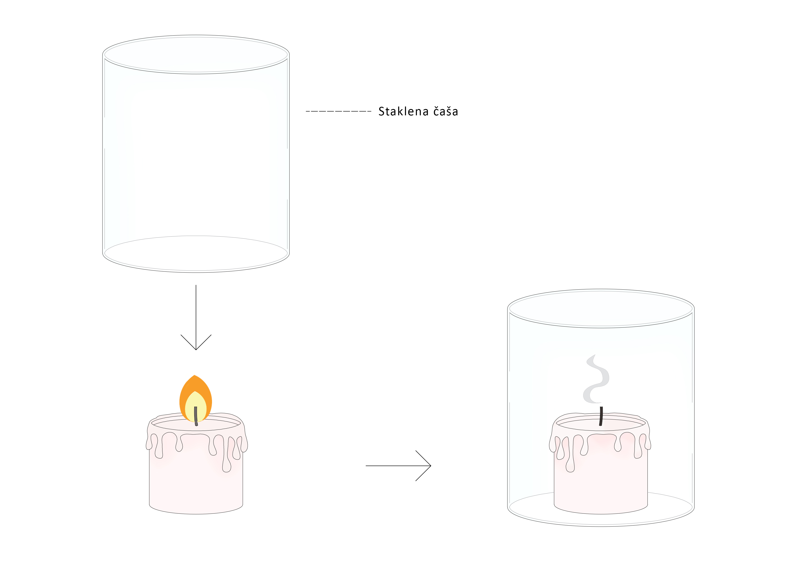

Kako dolazimo do saznanja o prirodi i spoljašnjem svetu? Ljudi su oduvek želeli da razumeju pravilnosti i zakone po kojima sve oko nas funkcioniše.  Pretpostavimo, na primer, da nas neko pita kako znamo da postoji gravitaciona sila. Većina nas bi verovatno uzela predmet i pustila ga da padne na pod. Ako to ne ubedi našeg sagovornika, mogli bismo postupak da _ponovimo_ _vise puta, pod istim uslovima._ Na taj način bismo izveli seriju *eksperimenata*.

Eksperiment je naučna metoda u kojoj simuliramo uslove da bismo utvrdili postojanje ili posmatrali neku pojavu. On se može ponavljati više puta, pod istim uslovima. Može se izvoditi u prirodi ili u laboratoriji. 

Kako biste na času fizike došli do zaključka da je vatri potreban kiseonik da bi gorela? Najverovatnije biste izveli eksperiment sa dve sveće, pri čemu biste jednu poklopili, a drugu ostavili otkrivenu. Ubrzo, samo druga sveća bi ostala da gori, dok bi se prva ugasila. Na isti način znamo da npr. papir  pluta a kamenčići tonu. I te tvrdnje jako lako možemo proveriti eksperimentima.

 

**Eksperimenti u verovatnoći**

Slučajan eksperiment je eksperiment koji ima sledeća svojstva: 
*	Unapred je definisano šta se smatra ishodom eksperimenta 
*	Poznat je skup svih mogućih ishoda, tj. prostor ishoda (oznaka-$\Omega$)
*	Ishod nije unapred poznat
*	Može se ponavljati proizvoljan broj puta pod istim uslovima

 

_Primeri_

1.	Bacanje novčića. 
  -	Ishodi ovog eksperimenta su da padne pismo ili glava
  -	Skup mogućih ishoda je P-pismo I G-plava, tj $\Omega$ ={P,G}
  -	Kao što smo naglasili u uvodu, za oba ishoda postoji određena verovatnoća sa kojom se realizuje, i ne znamo ishod unapred
  -	Možemo da bacimo novčić proizvoljan broj puta

2.	Bacanje kockice sa 6 strana.
  -	Ishodi ovog eksperimenta su da padne neki od brojeva od 1 do 6
  -	$\Omega$= {1,2,3,4,5,6}
  -	Takođe, ne znamo koji broj će pasti, tj  ne znamo ishod unapred jer je verovatnoća svakog po 1/6

3.	Podsetimo se vežbe iz uvodne teme u kojoj se izvodilo 10 serija po 4 bacanja kockice. Vaš zadatak je bio da zabeležite seriju u kojoj ste dobili bar jednu šesticu. Takvu seriju smo zvali uspešnom a u suprotnom neuspešnom. Na taj način izveli smo jedan eksperiment.
  -	Mogući ishodi su da je serija uspešna ili neuspešna
  -	$\Omega$ ={U,N},  gde je U-uspeh, N-neuspeh.

4.	 U fabrici se dnevno proizvodi 100 sijalica. Radnik broji neispravne sijalice.
  -	Mogući ishodi su svi brojevi od 0 do 100
  -	$\Omega$ ={1,2,3,4,…,98,99,100}

5.	Konstruisali smo proizvoljan trougao i odlučili da izmerimo jedan njegov ugao, pritom zaokružujući na najbliži ceo broj
  -	$\Omega$ ={1,2,3,…177,178,179}

6.	U kutiji se nalazi 10 kuglica – 4 plave,3 žute i 3 crvene boje. Iz kutije vadimo istovremeno 2 kuglice
  -	Ako sa P označimo plavu, Ž-žutu I C-crvenu kuglicu, tada je:$\Omega$ ={PŽ, PC,PP,ŽŽ,ŽC,CC}

7.	Na času fizičkog se trči na 30m i peticu dobijaju oni učenici koji istrče zadatu udaljenost za manje od 7 sekudi. Ako je u razredu 30 đaka, a mi beležimo one koji su dobili 5, opisati skup svih mogućih ishoda
  -	Kako bilo koji od učenika može da dobije 5, $\Omega$ ={0,1,2,3,….,29,30}

 

_Zadaci_:

**2.1** Baca se kocka za igru i ako padne broj manji od 3, kocka se baca još jednom. Odrediti skup ishoda.
 
Rešenje. Mogući ishodi su $\Omega$ ={{1,1}, {1,2}, {1,3}, {1,4}, {1,5}, {1,6}, {2,1}, {2,2}, {2,3}, {2,4}, {2,5}, {2,6}, {3}, {4}, {5}, {6}}.

 

**2.2**  Istovremeno se baca jedna kockica za igru i jedan novčić. Odrediti skup ishoda.
 
Rešenje. $\Omega$ ={1P, 2P, 3P, 4P, 5P, 6P, 1G, 2G, 3G, 4G, 5G, 6G}, gde je P-pismo a G-glava.

 

**2.3** Bacaju se dva novčića istovremeno. Koji su mogući ishodi?
 
Rešenje. $\Omega$ ={PG,PP,GG} gde je P-pismo a G-glava.

 

**2.4** Novčić se baca do prve pojave glave, a najviše četiri puta. Odrediti prostor ishoda.
 
Rešenje. $\Omega$ ={G,PG,PPG,PPPG,PPPP}.

 

**2.5** Na trci Formule 1 trka se 20 vozača. Ako beležimo poziciju koju je zauzeo proizvoljan vozač na kraju trke, koji ishodi su mogući?
 
Rešenje.  Kako ima 20 vozača, proizvodljni vozač može da završi na bilo kom od tih 20 mesta, dakle $\Omega$ = {1,2,3,4….,15,16,17,18,19,20}.

 

**2.6** U kutiji se nalazi 20 papirića na kojima su napisani prvih 20 brojeva. Izvlači se jedan papirić i registruje se samo ukoliko je izvučen prost broj, inače se papirić vraća u kutiju.  Odrediti prostor ishoda eksperimenta.
 
Rešenje. $\Omega$ ={2, 3, 5, 7, 11, 13, 17, 19}. 

