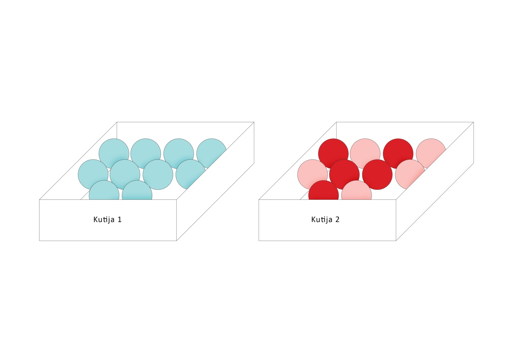

Podsetimo se, svakom eksperimentu pridružujemo prostor ishoda. To je skup svih mogućih ishoda tog eksperimenta i označava se grčkim slovom $\Omega$(sigma).
Svaki podskup A skupa $\Omega$ naziva se slučajan događaj. 

Primer 3.1 U kutiji 1 se nalazi 10 plavih kuglica, a u kutiji 2 – 5 crvenih i 5 roze. Da li biste za događaj da se iz kutije broj 1 izvuče crvena kuglica rekli da je   

a)	Siguran  

b)	Moguć  

c)	Nemoguć?  

Skica problema je data na slici.

Kao što nam intuicija govori, **siguran događaj** je onaj koji se uvek realizuje, odnosno, onaj događaj čija je verovatnoća jednaka 1.

 

**Primer 3.2** Događaj da se pri bacanju kockice za igru dobije prirodni broj manji od 6 je primer jednog sigurnog događaja.

 

**Nemoguć događaj** je događaj koji se nikad neće realizovati, tj. događaj čija je verovatnoća jednaka 0.  

Događaj iz primera 3.1 je nemoguć.  

 

**Moguć događaj** je događaj koji može da se realizuje, ali i ne mora. To je događaj čija je verovatnoća veća od 0 ali i manja od 1.  

**Primer 3.3** Događaj da se iz regularnog špila od 52 karte izvuče kralj je moguć.

#### Verovatnoća slučajnog događaja

 

Verovatnoća P proizvoljnog slučajnog događaja A je jednaka količniku broja povoljnih ishoda m i broja svih mogućih ishoda n.
Ili iskazano formulom:
$$P_A=\frac{m}{n}$$

Pošto je A podskup skupa $\Omega$, povoljan ishod za A će biti svaki ishod iz $\Omega$ čija realizacija povlači realizaciju događaja A.

 

**Primer 3.4** Baca se kockica za igru. Odrediti verovatnoću događaja A – pao je paran broj.
 
Rešenje. Hajde da prvo odredimo koji ishodi su povoljni. Znamo da je prostor ishoda $\Omega$={1,2,3,4,5,6}, što znači da je ukupan broj ishoda 6, tj n=6. 
Povoljni ishodi za događaj A su da padne 2, 4 ili 6. Ovde možemo da vidimo da se baš realizacijom nekog od ova tri ishoda realizuje i događaj A. Odavde sledi da je m=3, jer postoje tačno 3 povoljna ishoda.
Sada računamo verovatnoću događaja A prema formuli:
$$P_A=\frac{m}{n}=\frac{3}{6}=\frac{1}{2}$$
 
Dakle, tražena verovatnoća je jednaka  $\frac{1}{2}$ .

 

**Zadaci:**

 

**3.1** Istovremeno se bacaju dve kockice. Registruju se brojevi koji padnu. Koja je verovatnoća događaja A: zbir brojeva koji padnu je jednak 4?
 
Rešenje. Kao i u prethodnom primeru, prvo računamo ukupan broj ishoda, a zatim broj povoljnih ishoda, i na kraju to menjamo u formulu verovatnoće. 
Prostor ishoda je $\Omega$={{1,1}, {1,2}, {1,3}, {1,4}, {1,5}, {1,6}, {2,2}, {2,3}, {2,4}, {2,5}, {2,6}, {3,3}, {3,4}, {3,5}, {3,6}, {4,4}, {4,5}, {4,6}, {5,5}, {5,6}, {6,6}}. On ima 21 element.
Povoljni ishodi : {{1,3}, {2,2}}. Dakle, postoje 2 povoljna ishoda. Verovatnoća događaja A je:
$$P_A=\frac{2}{21}$$

 

**3.2** Iz regularnog špila karata izvlačimo jednu. Koja je verovatnoća događaja A - izvučena karta će biti crvene boje i B – izvučena karta je kec?
 
Rešenje.  Moguć ishod je izvlačenje bilo koje od 52 karte, dakle, broj ishoda je 52.
Povoljni ishodi za događaj A su izvlačenje bilo koje karte crvene boje kojih ima 26. Dakle, m=26.
Računamo verovatnoću događaja A:
$$P_A=\frac{26}{52}=\frac{1}{2}$$
Povoljni ishodi za događaj B su izvlačenje bilo kog od 4 keca iz špila, tako da je m=4.
Verovatnoća događaja B je:
$$P_B=\frac{4}{52}=\frac{1}{13}$$
 

**3.3** U kutiji se nalaze 5 roze i 4 ljubičaste loptice. Iz kutije se slučajno izvlači jedna loptica. Koja je verovatnoća događaja A – izvučena je ljubičasta loptica.
 
Rešenje. Mogući ishodi su izvlačenje bilo koje od 9 loptica u kutiji – dakle, n=9. Broj povoljnih ishoda je broj ljubičastih loptica u kutiji, što je 4. Dakle, verovatnoća je jednaka:
$$P_A=\frac{4}{9}$$
 

**3.4** Konstruisali smo proizvoljan trougao i odlučili da izmerimo jedan njegov ugao, pritom zaokružujući izmerenu vrednost na najbliži ceo broj. Koja je verovatnoća događaja A - ugao koji smo merili je tup?
 
Rešenje. Iz prethodne teme znamo da ishoda ima 179.
Ugao je tup ukoliko je veći od 90 stepeni. Dakle, njegova vrednost će biti neki od brojeva {91, 92, 93,…,177,178,179}. Povoljnih ishoda ima ukupno 179-90=89 (odnosno, od 179 brojeva, ne uzimamo prvih 90). 
Verovatnoća je onda jednaka:
$$P_A=\frac{89}{179}$$
 

**3.5** U kutiji se nalazi 4 kuglice – 1 plava, 2 žute i 1 crvene boje. Iz kutije vadimo istovremeno 2 kuglice. Odrediti verovatnoću događaja A – jedna od izvučenih kuglica je plava.
 
Rešenje.  Ako sa P označimo plavu, Ž-žutu I C-crvenu kuglicu, skup svih mogućih ishoda je $\Omega$={PŽ, PC, ŽŽ ,ŽC}. Dakle, n=4.
Broj povoljnih ishoda je 2, odnosno, to su ishodi {PŽ,PC}
Na kraju, verovatnoća je:
$$P_A=\frac{2}{4}=\frac{1}{2}$$
 

**3.6** Baca se kockica za igru, i ako padne broj manji od 3, kockica se baca još jednom. Koja je verovatnoća događaja A – proizvod brojeva koji su pali je paran?
 
Rešenje. Broj mogućih ishoda smo već odredili. Podsećanja radi, mogući ishodi su $\Omega$={{1,1}, {1,2}, {1,3}, {1,4}, {1,5}, {1,6}, {2,1}, {2,2}, {2,3}, {2,4}, {2,5}, {2,6}, {3}, {4}, {5}, {6}}, i njih ima ukupno 16.
Povoljni ishodi su {1,2}->2, {1,4}->4, {1,6}->6, {2,1}->2,{2,3}->6, {2,4}->8, {2,5}->10, {2,6}->12, {4}, {6}. Ukupno ih ima 10.
Tražena verovatnoća je jednaka:
$$P_A=\frac{10}{16}=\frac{5}{8}$$
 

**3.7** Novčić se baca do prve pojave glave, a najviše 10 puta. Odrediti verovatnoću događaja A – pala je glava i B – novčić je bačen manje od 5 puta.
 
Rešenje. Mogući ishodi su {G, PG, PPG, PPPG, PPPPG, PPPPPG,PPPPPPG, PPPPPPPG, PPPPPPPPG,PPPPPPPPPG, PPPPPPPPPP}. Ukupno ih ima 11.
Povoljni ishodi za događaj A su svi osim poslednjeg tj. svi osim {PPPPPPPPPP }. Ukupno ih ima 10.
Tražena verovatnoća je 
$$P_A=\frac{10}{11}$$
  
  
Povoljni ishodi za događaj B su {G, PG, PPG, PPPG}. Ukupno ih je 4.
Tražena verovatnoća je :
$$P_B=\frac{4}{11}$$

 

**3.8** U kutiji se nalazi 20 papirića na kojima su napisani prvih 20 brojeva. Izvlači se jedan papirić, i registruje se broj koji je na njemu zapisan. Izračunati verovatnoću događaja da je izvučen broj deljiv sa 3.
 
Rešenje. Prostor ishoda je prvih 20 brojeva, dakle, n=20.
Povoljni ishodi su {3,6,9,12,15,18}, te je m=6.
Ako sa A označimo događaj čiju verovatnoću tražimo, tada je:
$$P_A=\frac{6}{20}=\frac{3}{10}$$

