  

U prethodnom poglavlju smo se bavili prikupljanjem podataka i objašnjavali smo najbolje(najpravilnije) načine da se to odradi. U klasičnom statističkom istraživanju naredni korak je obrada tih podataka. 

 

Statističari koriste grafičko predstavljanje da bi bolje razumeli podatke i lakše uočili pravilnosti po kojima se oni menjaju. Na primer, možemo odmah videti koji odgovor je više zastupljen u zavisnosti od pola ili uzrasta. Na taj način je mnogo preglednije i jednostavnije doneti zaključke o podacima nego kada su predstavljeni u brojevima i procentima. 

 

### Kružni dijagram(pie-chart)

 

Kružni dijagram je vrsta grafičkog predstavljanja u kom su vrednosti prikazane veličinama kružnih isečaka. Što znači, veći kružni isečak – veći je udeo te veličine u ukupnom broju. Na primer, u Evropi 53% stanovnika je ženskog roda. Na kružnom dijagramu bi to izgledalo ovako:

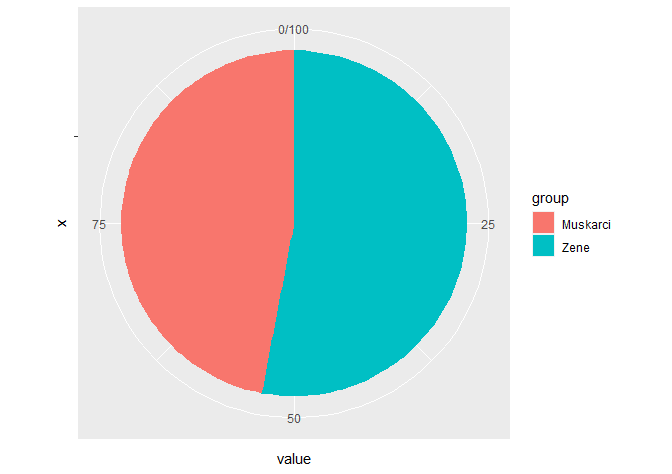

**Primer 7.1** U jednoj stambenoj zgradi ima 8 garsonjera, 23 jednosobna, 10 dvosobnih i 9 trosobnih stanova. Nacrtati kružni dijagram(pie-chart) koji prikazuje strukturu stanova u toj zgradi. 

 

Rešenje. Želimo da odredimo udeo(procenat) svake vrste stana. Zbog toga prvo računamo koliko ukupno ima stanova.
$$S=8+23+10+9=50$$
Udeo garsonjera izračunavamo na sledeći način

$\frac{8}{50}=0.16$,odnosno 16%  

Udeo jednsobnih stanova je:  

$\frac{23}{50}=0.46$,odnosno 46%  

Udeo dvosobnih stanova je:  

$\frac{10}{50}=0.2$,odnosno 20%  

Dok je udeo trosobnih je 100% - (16%+46%+20%) = 18%. Hajde da to prikažemo na dijagramu:

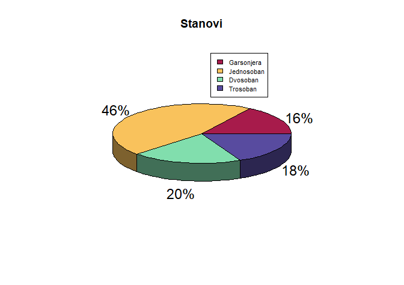
 

**Primer 7.2** 30 nasumično izabranih učenika je upitano koliko puta su posetili biblioteku prethode nedelje. Njihovi odgovori su dati u poljima tabele:

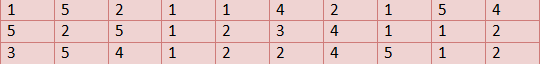

Analizirati odgovore i predstaviti ih kružnim dijagramom.

<bar>

Rešenje. Za početak prebrojavamo koliko odgovra ima za svaku vrednost.
5 puta je biblioteku posetilo 6 učenika.
4 puta – 5 učenika, 3 puta – 2 učenika, 2 puta -  8 učenika i jednom je u biblioteku otišlo 9 učenika.
Udeo u ukupnom broju ispitanih učenika za svaku vrednost možemo videti u narednoj tabeli:

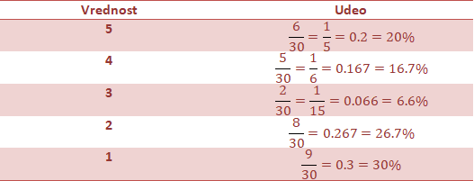

Na osnovu podataka, crtamo pie chart:

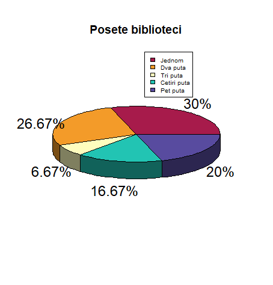

**Primer 7.3** Nacrtan je kružni dijagram za broj glasova na izborima za predsednika razreda. Analizirajte ga i odgovorite na pitanja:  

a) Ko je imao najviše glasova?  

b) Ko je imao najmanje glasova?  

c) Koji su učenici imali podjednak broj glasova?

Rešenje.
a) Naviše glasova, sa udelom od 36% je imala Maja  

b) Najmanje glasova, sa udelom od 9% je imao Aleksa  

c) Podjednak broj glasova, sa udelom od 14% su imali Luka i Marija  

 

**Primer 7.4** Jedna porodica je mesec dana vodila evidenciju potrošnje mesečnih primanja. Kružnim dijagramom na slici je prikazana njihova evidencija:

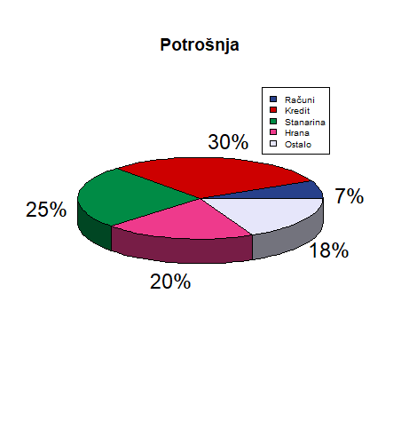

Protumačiti dijagram i odgovoriti na sledeća pitanja:  

a) Na šta porodica potroši najveći udeo primanja?  

b) Na šta porodica potroši najmanji udeo primanja?  

c) Koliki udeo primanja zauzima hrana?  

 

Rešenje.   

a) Porodica najveći udeo(30%) troši na kredit.  

b) Najmanji deo primanja(7%) troši na račune.  

c) Porodica na hranu daje 20% svojih mesečnih primanja.

 
 
 

##### Histogram

 

Histrogram je vrsta grafičkog predstavljanja podataka u kojem je visina stubića određena vrednostima podataka koje prikazujemo. Kao i kod kružnog dijagrama – što je viši stubić, to ta veličina ima veći udeo u ukupnom broju.
Na primer, predstavljamo histogramom iste podatke iz prvog primera o udelu ženskog i muškog pola u Evropi:

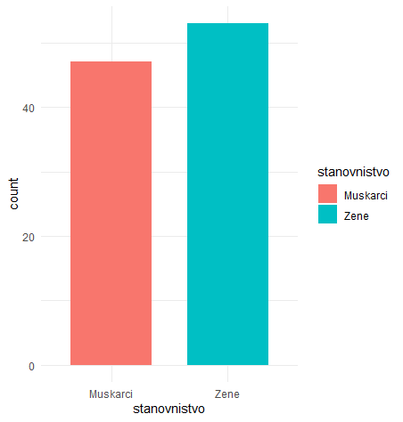

 

**Primer 7.5** U jednom istraživanju, ispitano je 210 korisnika na temu „Koju marku telefona koristite?“ Odgovori su bili: 120 – iPhone, 60 – Nokia i         30 – Samsung. Date podatke predstaviti u obliku histograma.

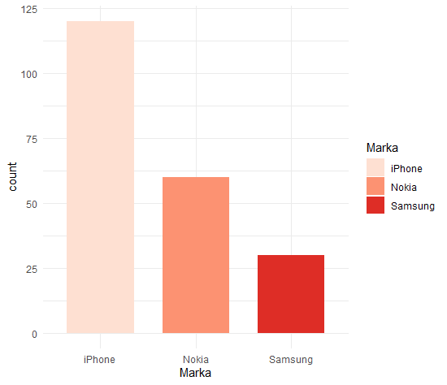

 

**Primer 7.6** U fabrici automobila je praćena prodaja automobila po bojama tokom 6 meseci. Dobijeni su sledeći podaci: bela boja - 16, crvena - 20, plava -4, braon – 3, zelena – 4, crna - 15, ostale – 12. Predstaviti podatke u obliku histograma

 
Rešenje.

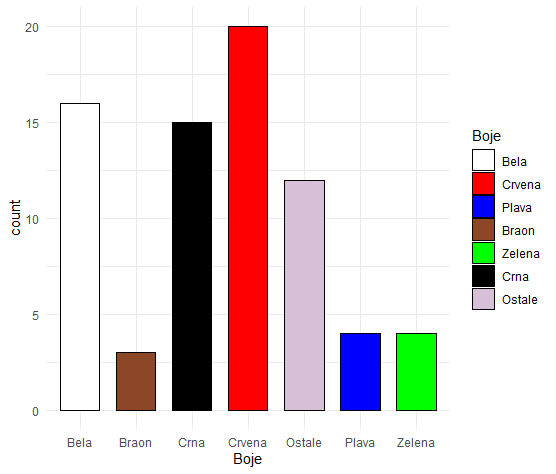

 

**Primer 7.7** Na dijagramu je prikazana starost majki pri rađanju deteta prošle godine. 

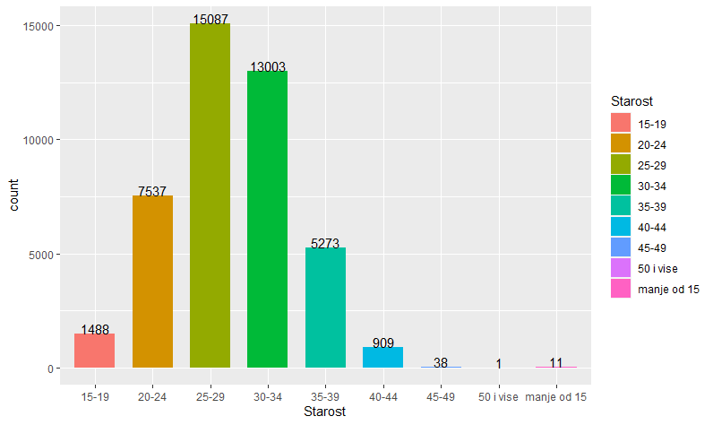

Analizirati histogram i odgovoriti na sledeća pitanja:  

a) U kom godištu su majke naviše rađale decu?  

b) U kom godištu su majke najmanje rađale decu?  

c) Koliko je ukupno dece rođeno prošle godine?  

d) Koliki je procenat majki mlađih od 30?   

 

Rešenje.    

a) Najviše su rađale žene starosti od 25 do 29 godina.  
b) Žene od 50 godina i više su najmanje rađale decu (1 slučaj).  
c) Ukupno je rođeno   
  $$11+1488+7537+15087+13003+5273+909+38+1=43345$$
d) Računamo udeo koji čine majke mlađe od 30. Njih je ukupno:
$$11+1488+7537+15087=24121$$
Udeo je jednak: 

$$\frac{24121}{43345} = 0.5565 $$

Odnosno 55.65%.

 

**Primer 7.8 **30 slučajno izabranih ljudi u šoping centru je pitano koliko poseduju kraditnih kartica. Odgovori su dati u poljima tabele:

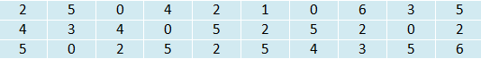

Nacrtati histogram vrednosti prikazanih u obliku udela

 

Rešenje. Napravićemo tabelu sa ukupnim brojevima po kategorijama i izračunati njihov udeo

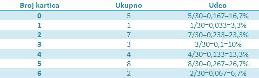

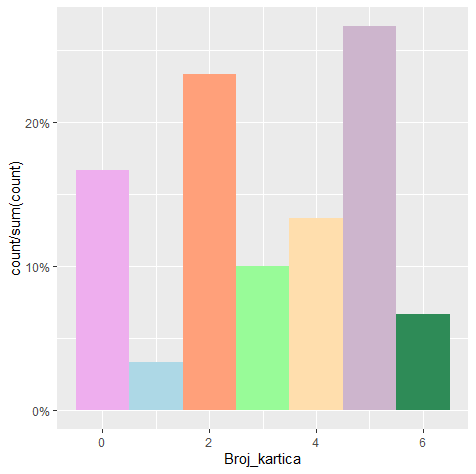

