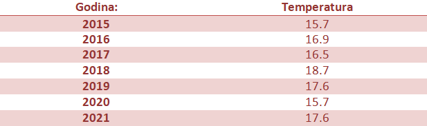
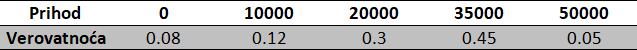
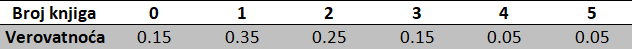

 

Da bismo razumeli pojam očekivane vrednosti, tj. očekivanja, objasnićemo ga na svakodnevnom primeru vremenske prognoze:  

 

**Primer 4.1** U jednoj ostrvskoj državi je u poslednjih 7 godina izmerena prosečna temperatura u julu, i ti podaci su uneti u tabelu:

Na osnovu datih podataka, kolika će biti prosečna temperatura u julu naredne godine u datoj državi?
Na koji način biste izračunali prosečnu temperaturu u poslednjih 7 godina?  
Na osnovu tabele, možemo zaključiti da se temperatura u poslednjih 10 godina kretala od 15.7 stepeni do 18.7 stepeni, i možemo da pretpostavimo da će i ostati u tom opsegu.    
Da bismo došli do odgovora na prvo pitanje, hajde da probamo da odbacimo neke manje verovatne vrednosti. Na primer, verujemo da je svima jasno da je najmanja verovatnoća da se ponove najmanje i najveće vrednosti iz tabele, kao i da se pojave vrednosti van opsega.
Te vrednosti smatramo ekstremnim i kao takve, možemo pretpostaviti da se neće baš uskoro ponoviti.  

Ovo razmatranje nas navodi da pomislimo na broj koji je bliži sredini, odnosno da je najverovatnije da će se naredne godine pojaviti takav broj, ili neki koji je njemu blizak.  
Sada možemo I da damo odgovor : broj do kog smo došli zovemo očekivana vrednost (u oznaci E) i u ovom primeru nju računamo prema sledećoj formuli : 

$$
E_T=\frac{15.7+16.9+16.5+18.7+17.6+15.7+17.6}{7}
$$

$$
=15.7*\frac{1}{7}+16.9*\frac{1}{7}+16.5*\frac{1}{7}+18.7*\frac{1}{7}+17.6*\frac{1}{7}+15.7*\frac{1}{7}+17.6*\frac{1}{7}
$$
Gde je T oznaka za prosečnu temperaturu u mesecu julu.

 

Formalno, očekivanu vrednost, ili matematičko očekivanje možemo definisati kao zbir verovatnoće svakog ishoda pomnožene sa vrednošću tog ishoda.
Strogo govoreći, prethodni primer nije skroz precizan, već služi idejno, da bismo videli način na koji koristimo očekivanje - kao neku vrstu predviđanja budućih vrednosti.
Posmatramo drugi red formule i uočavamo da sabiramo proizvod $\frac{1}{7}$ (verovatnoću da uzmemo vrednost iz 2015. Godine) i 15.7 (vrednost temperature za tu godinu) sa ostalim sabircima koji su nastali na isti način. 

 

**Primer 4.2** Učenici rade test koji ima 20 pitanja na zaokruživanje. Za svaki odgovor postoje 4 opcije – a), b), c) i d). Jedan učenik je rešio da na sva pitanja zaokruži isti odgovor, pod a). Sa kojom verovatnoćom će učenik dati tačan odgovor na proizvoljno pitanje? Koji je očekivan broj pitanja na koja će dati tačan odgovor?

 

Rešenje. Neka je A – događaj da je izabran odgovor tačan. Verovatnoća događaja A je : 
$P_A = \frac{1}{4}$ , jer od 4 opcije samo je jedan tačan odgovor, tj. samo jedan ishod je povoljan.  

Rekli smo da je očekivanje zbir proizvoda verovatnoća ishoda i odgovarajuće vrednosti. U ovom primeru, verovatnoća je za svako pitanje jednaka i to baš $P_A$, a vrednost tog ishoda je 1(ako je odgovor tačan) , odnosno 0 (ako odgovor nije tačan) jer računamo broj tačnih odgovora.  

$E_O= \frac{1}{4}*1*20=5$, gde je O broj tačnih odgovora na testu.  

Dakle, očekivana vrednopst broja tačnih odgovora na testu je 5.  

Do sada smo viđali samo primere gde je verovatnoća svakog ishoda jednaka. 

 

**Primer 4.3** Upravnik restorana je nakon analize nedeljnih prihoda, zaključio da njegov prihod ima verovatnoće date u sledećoj tabeli. Naći očekivanu vrednost prihoda restorana.

 
Rešenje: Prema formuli, računamo prvo proizvod verovatnoće pojedinačnog ishoda i vrednost tog ishoda, koje na kraju saberemo.
$E_P=0*0.8+10000*0.12+20000*0.3+35000*0.45+50000*0.05=25450$  
  
Gde je P - nedeljni prihod restorana.

 

Pojam matematičkog očekivanja tj. očekivane vrednosti može da ima veliku primenu u donošenju odluka, što naredni primer dobro ilustruje.

 

**Primer 4.4** Pretpostavimo da je upravniku restorana iz primera 4.3 ponuđeno da radi u drugom restoranu, gde je nedeljni prihod 32000, a gde bi imao isti udeo kao i na trenutnom random mestu. Da li upravnik na osnovu zarade treba da prihvati novi posao, ili treba da ostane na starom?
 
Rešenje.  Kako je 32000 veći prihod od očekivanog prihoda na starom poslu (izračunat u primeru 4.3), zaključujemo da upravnik treba da prihvati novi posao.

 

**Primer 4.5** Na osnovu prethodnog iskustva, radnici Narodne biblioteke u Beogradu znaju da korisnici uzimaju određen broj knjiga sa verovatnoćama datim u tabeli. Izračunati matematičko očekivanje broja uzetih knjiga.

Rešenje.  Na već poznat način, množimo verovatnoće sa vrednostima iz prvog reda tabele:
$$E_B=0*0.15+1*0.35+2*0.25+3*0.15+4*0.05+5*0.05=1,75$$
Dakle, možemo pretpostaviti da je očekivani broj 2, odnosno, da se obično uzimaju po 2 knjige.

 

**Primer 4.6** Društvo je smisilo igru sa sledećim pravilima:
Jedna osoba baca  kockicu i ako padne 1, 2, 3 ili 4, dobija 50 dinara, a u suprotnom, ukoliko padne 5 ili 6, gubi 80. Koja je očekivana suma novca koju će ta osoba imati na kraju igre? Da li se uopšte isplati igrati ovakvu igru?
 
Rešenje. Neka je A – događaj da je palo 1, 2, 3 ili 4 a B – događaj da je palo 5 ili 6. Verovatnoća događaja A je:
$P_A=\frac{4}{6}=\frac{2}{3}$,  jer je od ukupno 6 ishoda, 4 povoljno.  

Neka je B – događaj da je palo 5 ili 6. Verovatnoća događaja B je
$P_B=\frac{2}{6}=\frac{1}{3}$, jer je od ukupno 6 ishoda, 2 povoljno.  

Očekivana vrednost sume je:
$$E_S=P_A*50+P_B*(-80)=2/3*50-1/3*80=6.67$$

Dakle, kako smo dobili pozitivnu vrednost, zaključujemo da se isplati igrati ovu igru.  

 

**Primer 4.7** U kutiji 1 se nalazi 8 kuglica, od kojih su 6 plave a 2 crne. U kutiji 2 se nalazi 5 kuglica od kojih su 3 plave, a 2 roze. Iz obe kutije se izvlači po jedna kuglica. Koja je očekivana vrednost broja plavih kuglica?  

Rešenje. Ideja je da izračunamo očekivane vrednosti broja kuglica u svakoj od kutija, i da ih nakon toga saberemo.
Iz kutije 1, plavu kuglicu izvlačimo sa verovatnoćom $\frac{6}{8}=\frac{3}{4}$, jer od 8 kuglica, 6 su plave. 
Iz kutije 2, plavu kuglicu izvlačimo sa verovatnoćom $\frac{3}{5}$, jer od 5 kuglica, 3 su plave.  

Ukupno očekivanje je jednako:
$$E_P=\frac{3}{4}*1+\frac{3}{5}*1= \frac{3*5+3*4}{20}=1.35$$

Dakle, očekujemo da će se izvući 1 plava kuglica iz obe kutije.

