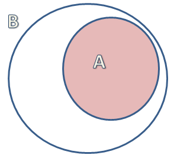
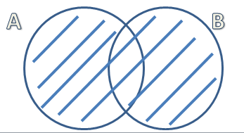
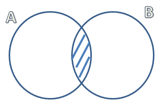
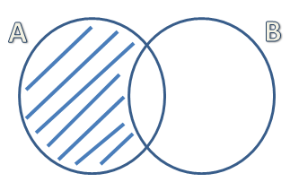
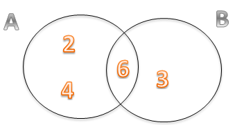

 

Napravićemo mali podsetnik osnovnih skupovnih operacija. Nas će zanimati 4 osnovne relacije, a to su:

1. Podskup skupa: Skup A je podskup skupa B ako se svi elementi koji se nalaze u A, nalaze i u B. Oznaka je $A \subset B$. 

2. Unija: unija skupova A i B obuhvata sve elemnete oba skupa, tj. element pripada uniji ako pripada skupu A ili skupu B. Oznaka je $A \cup B$. Unija je osenčena na slici.

3. Presek: presek skupova A i B obuhvata sve elemente koji se nalaze  u oba skupa, tj.  element pripada preseku ako pripada skupu A i skupu B. Oznaka je $A \cap B$

4. Razlika: razlika skupova A i B obuhvata sve elemente koji se nalaze u A ali se ne nalaze u skupu B. Oznaka je $AB^c$

 

Pokazaćemo na primerima kako se skupovne operacije primenjuju prilikom izračunavanja verovatnoće.

 

**Primer 4.8** Neka je događaj A – na kockici za igru je pao paran broj a događaj B – pao je broj deljiv sa tri. Odrediti presek, uniju i razliku događaja A i B i izračunati njihovu verovatnoću.  
 
Rešenje. Odredimo prvo ishode povoljne za događaj A. To su {2,4,6}. Povoljni ishodi za događaj B su {3,6}.

U uniji se nalaze svi ishodi koji su povoljni za oba događaja, odnosno u ovom slučaju, to su ishodi da je broj paran ili deljiv sa 3, tj $A \cup B$ = {2,3,4,6}.  

Broj povoljnih ishoda je 4, a ukupan broj ishoda je 6. Odatle sledi da je  
$$P_{A \cup B}=\frac{2}{6}=\frac{1}{3}$$
U preseku se nalaze svi ishodi koji su i parni i deljivi sa 3, odnosno $A \cap B$={6}.  

Broj povoljnih ishoda je 1. Odatle sledi da je verovatnoća:
$$P_{A \cap B}=\frac{1}{6}$$
Za razliku $AB^c$ podrazumevamo sve ishode koji su parni, a nisu deljivi sa 3, odnosno $AB^c$={2,4}.  

Broj povoljnih ishoda je 2. Odatle sledi da je verovatnoća:
$$P_{AB^c}=\frac{2}{6}=\frac{1}{3}$$

