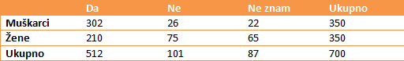
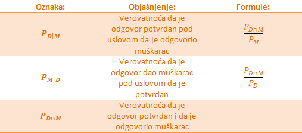
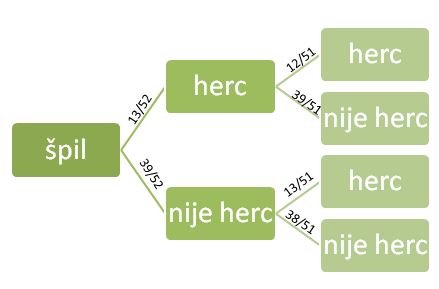
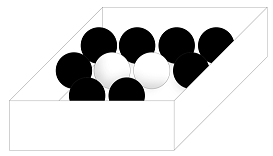
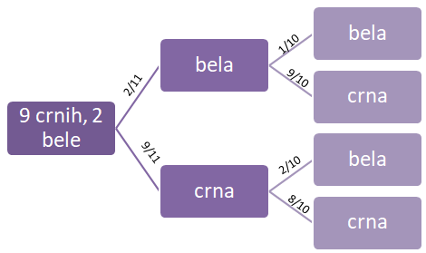

 

Razne ankete i kvizovi koje svakodnevno pronalazimo u novinama i na internetu često traže od nas da obeležimo kog smo pola, koliko imamo godina, koje smo nacionalnosti kao i nivo obrazovanja. To se radi da bi se odgovori kategorisali prema raznim osobinama ispitanika. Na primer, odgovori na pitanja koja se tiču politike često variraju u zavisnosti od dela zemlje gde žive. Takođe nivo obrazovanja može da utiče na anketu vezanu za aktuelne teme, poput vakcinacije. Ovi primeri predstavljaju klasičan primer primene uslovne verovatnoće.

 

**Primer 5.1** U anketi koju su sproveli novinari, ispitano je 700 ljudi na temu : „Da li mislite da je dužina trajanja reklama na kanalima nacionalne frekvencije previše velika tokom emitovanja zabavnog programa, filmova, serija“. Odgovori su prikazani u tabeli:

 

Analiza rezultata: od 700 ljudi, 512 je dalo potvrdan odgovor, što nam govori da većini smeta dužina trajanja reklama. Takođe, do još bitnijeg zaključka dolazimo kada uporedimo brojeve za muškarce i žene. Primećujemo da muškarcima mnogo više smeta dužina trajanja reklama, tj čak $\frac{302}{350}$=86% muškaraca, dok samo $\frac{210}{350}$=60% žena smatra da reklame predugo traju.

 
 

Hajde da obeležimo sa slovom Ž obeležimo događaj – odgovor je dala žena, i sa M- odgovor je dao muškarac. Takođe, sa D – odgovor je da i N-odgovor je ne. Tada, događaj da je žena dala potvrdan odgovor bismo zapisali kao:  
$D \mid Ž$ 
Pri čemu znak | tumačimo kao „pod uslovom“.   
Događaj D | Ž možemo pročitati kao: odgovor je da, pod uslovom da ga je dala žena.  
Verovatnoća ovakvog događaja se naziva **uslovna verovatnoća događaja** .    

Možemo da je izračunamo:  

$$
P_{D|Ž}=\frac{210}{350}=0.6
$$
  

 
 
  
**Definicija: Uslovna verovatnoća događaja A u odnosu na događaj B se definiše kao verovatnoća da se realizovao događaj A ako se realizovao događaj B i ona se računa po formuli:**
$$
P_{A \mid B}=\frac{P_{A \cap B}}{P_B}
$$

 

**Primer 5.2** Na slučajan način  se izvlači jedna karta iz špila od 52 karte. Ako znamo da je izvučena karta herc, odrediti verovatnoću da je ta karta desetka.  
Rešenje. Obeležimo događaj A-slučajno izabrana karta je desetka,  
a događaj B – slučajno izabrana karta je herc.  
Zadatak traži da se odredi verovatnoća događaja $A \mid B$. 
U ovom zadatku,  $A \cap B$ je događaj da je izabrana karta desetka herc, i njegova verovatnoća je:
$$
P_{A \cap B}=\frac{1}{52}
$$
  
Sada računamo verovatnoću događaja B:
$$
P_B=\frac{13}{52}
$$
  
Jer je ukupan broj karata sa herc simbolom jednak 13.  
Na kraju, dobijene brojeve ubacujemo u formulu uslovne verovatnoće
$$
P_{A \mid B}=\frac{P_{A \cap B}}{P_B}=\frac{\frac{1}{52}}{\frac{13}{52}}=\frac{1}{13}
$$
  
  

 
 

Pre nego što pređemo na jednu važnu formulu, razgraničićemo tri na prvi pogled slična, ali potpuno različita pojma. Posmatramo tabelu:  

 
 

### Pravilo proizvoda

Kako biste odredili verovatnoću da od dve izvučene karte, obe budu herc? Za početak, jednostavno je odrediti verovatnoću da je prva karta herc: $\frac{13}{52}$. Međutim, kako bismo odredili da je i naredna herc? Kada bismo znali da je prva izvučena karta bila herc – tada bismo znali da je ostalo još 12 herc karata, te je verovatnoća $\frac{12}{51}$  

 

Transformacijom formule uslovne verovatnoće, možemo dobiti formulu koju zovemo pravilo proizvoda:  
$$
P_{A \cap B}=P_{A \mid B}*P_B
$$

 
  
Neka je u primeru sa kartama sa A označen događaj da je druga izvučena karta herc i sa B – događaj da je prva izvučena karta herc.Tada je $P_{A \mid B}$ verovatnoća da je druga izvučena karta herc, pod uslovom da je i prva. Tu verovatnoću smo već računali, i znamo da iznosi $\frac{12}{51}$.Verovatnoća događaja B je $P_B=\frac{13}{52}$.  
Verovatnoću događaja  – obe karte su herc možemo izračunati kao:
$$
P_{A \cap B}=\frac{13}{52}*\frac{12}{51}=\frac{3}{51}=0.06
$$
  
Dakle, verovatnoća da su obe karte herc je oko 6%.  

 
 

#### Stablo dijagram  

   
   
 Na slici se nalazi stablo dijagram našeg problema sa kartama. Crtanje nam stabla najčešće pomaže da lakše dođemo do rešenja.    
 

Na granama stabla se nalaze verovatnoće ishoda do kojih vode. Na primer, verovatnoća da se izvuče karta koja nije herc iz punog špila je 39/52. Verovatnoća da se izvuče karta koja nije herc, nakon što je izvučena karta koja jeste je 39/51.  
  
  
  
 
**Zadaci **  
 

**5.3** U kutiji se nalaze 2 bele i 9 crnih kuglica. Izvlačimo nasumično 2, jednu po jednu, bez vraćanja. Kolika je verovatnoća da izvučemo crnu kuglicu pod uslovom da smo već izvukli belu? Kolika je verovatnoća da ćemo u prvom izvlačenju izvući belu, a u drugom crnu? 

  
Rešenje. Označimo A-događaj da je u drugom izvlačenju izvučena crna kuglica, a B-događaj da je u prvom izvlačenju izvučena bela kuglica. Događaj da je izvučena crna kuglica pri uslovu da je već izvučena bela je događaj $A \mid B$. Verovatnoću računamo pomoću stablo dijagrama  

 
Sa dijagrama možemo da pročitamo da je uslovna verovatnoća koja nam je potrebna(prvo biramo belu pa crnu) jednaka 9/10.  
Verovatnoća da se u prvom izvlačenju izvuče bela, a u drugom crna je verovatnoća preseka događaja A i B, i računamo je po pravilu proizvoda, odnosno:  
$$
P_{A \cap B}=P_{A \mid B}*P_B=\frac{\frac{9}{10}*2}{11}=\frac{9}{55}=0.163
$$  
  
  
**5.4** Bačena je kockica za igru. Naći verovatnoću da je:  
a) Pala šestica  

b) Pala šestica, ako znamo da je pao paran broj    

c) Pala šestica, ako znamo da je pao prost broj  

Rešenje.  

a) Neka je A-događaj da je pala šestica. $P_A=\frac{1}{6}$   

b) Neka je B- događaj da je pao paran broj. $P_B=\frac{1}{2}$   

Događaj da je pala šestica, ako znamo da je pao paran broj je zapravo događaj A|B, i njegovu verovatnoću računamo po formuli. Pre toga, treba da kažemo da je presek događaja A i B zapravo sam događaj A, jer je podskup od B, tj. bacanje šestice je podskup od događaja da je bačen paran broj.
$$
P_{A \mid B}=\frac{P_{A \cap B}}{P_B}=\frac{\frac{1}{6}}{\frac{1}{2}}=\frac{1}{3}
$$
  
c) Neka je C- događaj da je pao prost broj. $P_C=\frac{3}{6}$, jer su prosti brojevi do 6 brojevi 2, 3 i 5.  

Događaj da je pala šestica, ako znamo da je pao prost broj je zapravo događaj $A \mid B$, i njegovu verovatnoću računamo po formuli. Pre toga, treba da kažemo da je presek događaja A i C zapravo prazan skup, jer šest nije prost broj. Dakle, samim tim verovatnoća događaja $A \cap B$ je nula, pa je i verovatnoća događaja $A \mid B$ takođe nula.  

 
  
**5.5** Proizvođač laptopova kupuje 38% čipova iz Japana, a ostatak iz Amerike. Od čipova iz Japana, 1.7% je neispravno, a iz Amerike 1.1%. Naći verovatnoću da je čip neispravan i napravljen u Americi.  
  
 

Rešenje. Neka je A- događaj da je čip neispravan, B – događaj da je čip napravljen u Americi. Traži nam se presek tih događaja, i njega računamo po formuli.
$$
P_{A \cap B}=P_{A \mid B}*P_B
$$
Znamo da je uslovna verovatnoća događaja A|B zapravo verovatnoća da je čip neispravan, pri uslovu da je napravljen u Americi, i tu verovatnoću znamo i ona je jednaka $\frac{1.1}{100}=0.011$  
Verovatnoća događaja B je $\frac{62}{100}=0.62$  
Vrednosti menjamo u formulu i dobijamo 
$$
P_{A \cap B}=0.011*0.62=0.00682
$$

