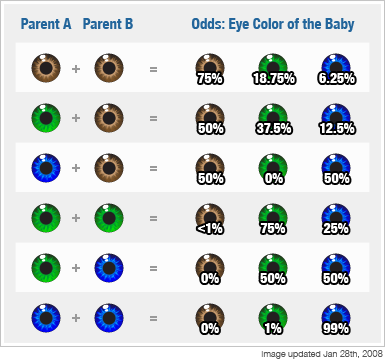
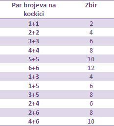
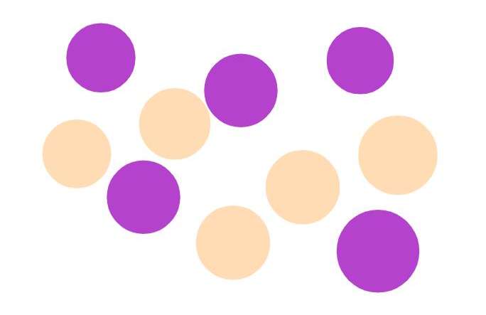
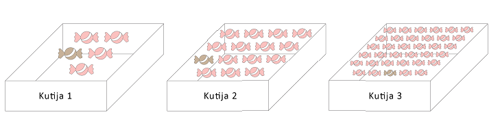

    
Sa verovatnoćom se susrećemo celog života i uvek je deo naše svakodnevnice. Na primer, ujutru slušamo vremensku prognozu i često čujemo rečenicu: „Verovatnoća padavina je ...%“.  

Na putu do škole razmišljamo o verovatnoći da nas nastavnica prozove da odgovaramo. U slobodno vreme, razmišljamo o verovatnoći da naš omiljeni tim postigne gol ili pobedi na prednostojećoj utakmici. Iako ne razmišljamo previše o samom pojmu verovatoće, ona je deo naše stvarnosti i zbog toga je bitno da je bolje razumemo i izučimo.  

| Intersantan je razlog zbog kojeg je jedan matematičar počeo da proučava verovatnoću po prvi put: naime, francuski plemić koji je voleo da se kocka, zamolio je svog prijatelja matematičara da mu objasni zašto gubi toliko novca. Znamo da i danas verovatnoća igra veliku ulogu u radu kladionica.   

 
 

_Vežba_

| Hajde da probamo da simuliramo problem francuskog plemića. Zarađivao je tako što se kladio da u 4 bacanja može da dobije barem jednu šesticu. Nazovimo takvu seriju uspešnom, a u suprotnom neuspešnom. Bacajte kockicu 4 puta i zabeležite koliko puta ste dobili šesticu. Ponovite postupak 10 puta. Ako ste pred svaku seriju od 4 bacanja uložili 1 bombonu, a za uspešnu seriju dobijate 2, koliko bombona ukupno imate na kraju vežbe?

 
 

**Igre na sreću**

Takođe, igre na sreću poput loto-a, greb-greb kartica, kao i ruleta i svih igara koje se mogu naći u kazinima koriste načela verovatoće. Verovatno ste primetili da ishod i dobitak u takvim igrama ne zavisi od naših sposobnosti, već samo od nasumičnog izbora brojeva, kako sa naše strane, tako i sa strane raznih mašina. Iz razloga što postoji veliki broj mogućnosti od kojih takmičar bira, šansa za dobitak je mala, ili preciznije, verovatnoća dobitka je mala. Ipak, kako je dobitak u takvim igrama veliki, ljudi često zaobilaze činjenicu da je šansa da osvoje novac mala, tj. praktično ne postoji, i ipak učestvuju u tim igrama.

 
 

**Genetika**

Da li ste nekad razmišljali zašto se kaže da ličite na majku, a tvoj brat ili sestra na oca? Ili zašto je moguće da jedno dete nasledi plave oči od oca, a drugo braon od majke? Sve se to dešava po zakonima verovatoće koja je ključni deo naše genetike i pravila nasleđivanja. 

 
 
Verovatnoća je takođe pronašla veliku primenu u finansijama i predstavlja temelj rada svake banke, osiguravajuće kuće, investicione firme...

 

_Primeri_

*	Klasičan primer sa kojim smo se svi sreli je bacanje novčića. Znamo da bacanje novčića ima dva moguća ishoda: da padne glava ili da padne pismo. Da li je verovatnije da će pasti glava ili pismo?

Odgovor, zapravo, zavisi od samog novčića. Ukoliko bacamo običan novčić od, recimo, 5 dinara, možemo biti sigurni da su nam šanse za oba ishoda jednake – u ovom slučaju, po 50%. 
Iz tog razloga, često viđamo bacanje novčića kao način izbora između dve mogućnosti, ukoliko taj izbor mora biti nasumičan. 
Na primer, ako biramo koji od 2 igrača je prvi na potezu.  Ovu tehniku koristili su u 1998. u Americi na meču Detorit protiv Pitsburga. Pre početka produžetaka, sudija je bacio novčić kako bi se odlučilo koji tim će imati prvi posed. Iako je igrač Pitsburga uzviknuo „pismo“, sudija je čuo „glava“, i nakon što je palo pismo, posed dodelio suparničkom timu, koji je na kraju, zahvaljujući tome, pobedio. Uprkos velikoj grešci sudije, metod bacanja novčića nastavio je da se koristi u sportu u ovakvim i sličnim situacijama.

* Sličan princip ima i svima poznato bacanje kockice. Za razliku od novčića, koji je imao samo 2, regularna kockica ima 6 ishoda i to su najčešće prvih 6 prirodnih brojeva.  Isto kao i kod novčića, verovatnoća da padne bilo koji od tih brojeva je jednaka, tj. verovatnoća svakog je 1/6, odnosno  približno 16,67.%. Kao što i znamo, najviše se koriste u društvenim igrama. Iako smo svi navikli na standardnu kocnicu sa 6 strana, postoje i kockice sa 4, 10, 48 ili čak 120 strana.

 
 

_Zadaci_

 

1. Ako bacate novčić 20 puta, koliko približno puta će pasti glava, a koliko pismo?

Rešenje.  Ne možemo reći sa sigurnošću tačan broj. Međutim, znamo da je verovatnoća oba ishoda jednaka, pa možemo da pretpostavimo da će najverovatnije pasti 10 pisama i 10 glava.

 

2. Neka se bacaju 2 kockice istovremeno*. Koliko ima ishoda gde je zbir brojeva koji padnu paran?

Rešenje.  Zbir dva broja je paran ukoliko su oba parna ili oba neparna. To znači da nama odgvoaraju sledeće kombinacije:

Dakle, ukupan broj ishoda koji nam odgovaraju je 12.  

*Ukoliko naglasimo da se bacanja dešavaju istovremeno, znači da ne razlikujemo ishode 1+3 i 3+1, tj. registrujemo samo brojeve, nezavisno od redosleda.

 

3. Bacamo pet novčića. Na koliko različitih načina se mogu pojaviti tačno četiri glave?

Rešenje.  Ako sa P označimo da je palo pismo a sa G da je pala glava, mogući slučajevi su predstavljeni na slikama:

 

4. Ako delimo 26 karata iz špila karata, koliko će najverovatnije biti crvenih i koliko će najvervatnije biti kečeva?

Rešenje.  Pravilan špil ima 52 karte. Polovina njih je crvena, a druga polovina crna. Postoje 4 keca. 
Ako delimo 26 karata, to je polovina od ukupnog broja karata u špilu. To znači da će u 26 karata takođe najverovatnije polovina biti crvena, a druga polovina crna. 
Tako da je odgovor da će najverovatnije biti 13 crvenih karata.
U 26 karata najverovatnije će, po istom principu, biti 2 keca. 

 

5. Iz špila delimo 13 karata. Koliko će prilbižno biti ukupno kraljeva, dama i žandara?

Rešenje.  13 karata je četvrtina špila. Kraljeva, dama i žandara ima po 4, odnosno ukupno 12 u celom špilu. To znači da će najverovatnije, u četvrtini špila biti 3.

 

6. U kutiji se nalaze ljubičaste i roze loptice. Nasumično iz kutije izvlačimo jednu lopticu. Da li je veća verovatnoća da izvučemo ljubičastu ili roze lopticu? Ako smo izvadili jednu roze lopticu, koju boju izvlačimo sa većom verovatnoćom?

Rešenje.  Na slici ima 5 roze i 4 ljubičastih loptica. Kako je više rozih, veća je verovatnoća da se izvuče roze loptica.
Ako smo izvukli roze lopticu, tada nam ostaje 4 roze i 4 ljubičaste. Pošto ih ima jednak broj, jednaka je verovatnoća da bilo koja od njih bude izvučena. 

 

7. U tri kutije nalazi se, redom, 5, 15 i 35 bombona. U svakoj kutiji je jedna bombona čokoladna, a ostale od višnje. Da li je verovatnije da izvučemo bombonu od čokolade ili višnje iz druge kutije? Iz koje kutije je najverovatnije da izvučemo čokoladnu bombonu? Iz koje kutije je najverovatnije da ćemo izvući bombonu od višnje?

Kako u drugoj kutiji ima 1 bombona od čokolade, a 14 od višnje, veća je verovatnoća da se izvuče bombona od višnje.   
U prvoj kutiji od 5 bombona, jedna je čokoladna, pa je verovatnoća da nju izaberemo 1/5. Na isti način, verovatnoće da izvučemo čokoladnu bombonu iz druge i treće kutije su redom 1/15 i 1/35. Od ta tri broja, 1/5 je najveći, pa je verovatnoća da izvučemo čokoladnu bombonu najveća za prvu kutiju.  
U prvoj kutiji, od 5 bombona, jedna je čokoladna, pa je ostalih 4 od višnje, te je verovatnoća da izvučemo bombonu od višnje iz prve kutije 4/5. Na sličan način, verovatnoće da izvučemo iz druge i treće kutije su, redom, 14/15 i 34/35. Od ta tri broja, najveći je 34/35, pa je ta verovatnoća najveća za treću.