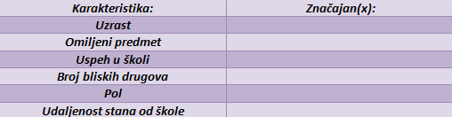

 

Kada kupujemo novi mobilni telefon, možemo u karakteristikama videti razne podatke – od memorije preko kapaciteta baterije do rezolucije ekrana. To se ubraja u statističke podatke i oni predstavljaju veoma važne faktore prilikom odlučivanja. Kada gledate sportski događaj tokom i nakon meča možete da analizirate statistiku timova. Između ostalog, ona ukazuje i samim trenerima timova na kojim slabostima treba da porade.
Sve u svemu, kao i verovatnoća, statistika je prisutna svuda i koristi se u najrazličitijim obastima.   

**Populacija** je, kao što ste učili iz biologije, skup jedinki iste vrste na nekom prostoru. Obično nam je od intresa neka osobina koju posmatramo kod svake jednike populacije. 

 

**Primer 6.1** Recimo da nas intresuje mišljenje stanovnika Srbije o tome ko će biti naredni predsednik. Takvo pitanje intresuje politikologe, analitičare, ali i same građane. Idealno bi bilo kada bismo mogli da pitanje postavimo svakom stanovniku, njihove odgovore zabeležimo, i dođemo do zaključka. Međutim, da li mislite da je tako nešto moguće i neophodno? Zapravo, moguće je, ali je veoma nepraktično jer bi pre svega puno vremena i novca bilo utrošeno.  

Jedina vrsta ispitivanja gde je zaista neophodno da se svaki stanovnik ispita je popis i zbog gore navedenih razloga se sprovodi na svakih 10 godina.  

Za svako drugo istraživanje bilo je potrebno naći jeftiniju alternativu koja bi dala verodostojne razultate. Kako nismo u mogućnosti da ispitamo svakog građanina, logično bi bilo da ispitamo manju grupu ljudi.  

  
Skup jedinki koji izaberemo za ispitivanje naziva se **uzorak**.   

Uzorak se bira na slučajan način što znači da se ne bira nijedna specifična grupa, da se bira bez obzira na bilo čije želje i bez nekog pravila. To je jedna od osobina koju uzorak mora da poseduje. Pored osobine slučajnosti, uzorak mora da ispuni još neke uslove.  

  
**Primer 6.2** Recimo da želite da sprovedete istraživanje na nivou vaše škole, na temu omiljenog predmeta. Kako biste to izveli tako da pitate što manje ljudi, a dobijete što bolju sliku o mišljenju većine? Poenta ovakvog istraživanja je da saznamo koji predmeti su najpopularniji među učenicima, kao i način na koji se njihovo intresovanje menja kroz godine.  

Jasno nam je da bi pogrešno bilo da pitamo samo dečake ili samo učenike sedmog razreda. Odavde možemo da zaključimo da je cilj da pronađemo takvu grupu ljudi koja najbolje oslikava celu školu.   

Takav uzorak nazivamo **reprezentativnim**. To je najvažnija osobina koju uzorak mora da poseduje.  

Odgovor na zadatak u prethpodnom primeru:   

Pre svega, najbitnije nam je da ispitamo iz svakog razreda bar jednu mušku i bar jednu žensku osobu, jer afiniteti mogu da se razlikuju u odnosu na godine i pol. Još jedan bitan faktor je je uspeh u školi i važno je da u naš uzorak ne obuhvata samo učenike sa dobrim ili samo sa lošim prosekom ocena.  

 

**Primer 6.3** Sprovodimo anketu u našoj ulici na temu omiljenog žanra filma. U tabeli sa ’x’ označite one kategorije za koje smatrate da su neophodne kako bi uzorak bio reprezentativan.

 
 

Odgovor ukratko obrazložiti.

 

**Primer 6.4** Sprovodimo anketu među učenicima viših razreda na temu mišljenja o online nastavi. U tabeli sa ’x’ označite one kategorije za koje smatrate da su neophodne kako bi uzorak bio reprezentativan.

 
 
  
  
Odgovor ukratko obrazložiti.

